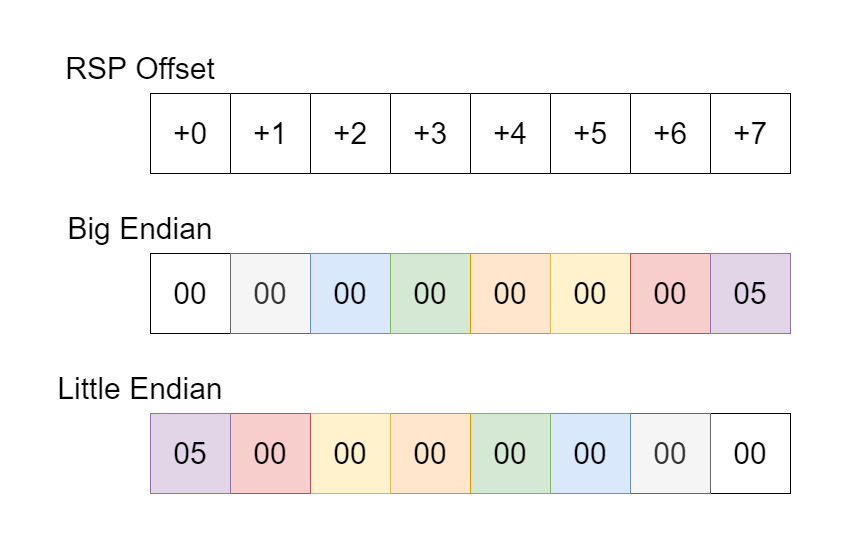

# Tutorium 1 (zu Blatt 2)

### Zu Frage 6
Das Programm in [quiz/env.S](quiz/env.S) lässt sich mit dem Befehl

    make env

im `quiz`-Unterordner kompilieren (natürlich nach jeder Änderung nochmal erneut ausführen). Benötigt werden dafür `gcc` und `make`, die sich mit `sudo apt-get install gcc make` installieren lassen.

Dann kann man das Programm ausführen und sich den Exit-Code anzeigen lassen:

    ./env 1 2 3 4; echo $?

Standardmäßig gibt es den Wert des Bytes an `[rsp + 7]` als Exit-Code zurück (was fast immer `0` ist).

Im Code ist auch noch eine Zeile, die den Wert an `[rsp+0]` lädt. Dafür einfach das `//` am Anfang der Zeile entfernen.

Wie im folgenden Bild zu sehen müsste -- wenn genau 4 Argumente übergeben werden -- das Byte an `[rsp+0]` den Wert `5` haben. Wichtig ist, dass man die "Little Endian" Werte anschaut, da x86-64 ja diese byte order hat.

Der Wert ändert sich natürlich, wenn man noch mehr Argumente hinzufügt. So gibt

    make env; ./env 5 4 3 2 1 0; echo $?

Die Zahl `7` aus, da `6` Argumente übergeben wurden (und der Programmpfad auch noch als Extra-Argument zählt).
